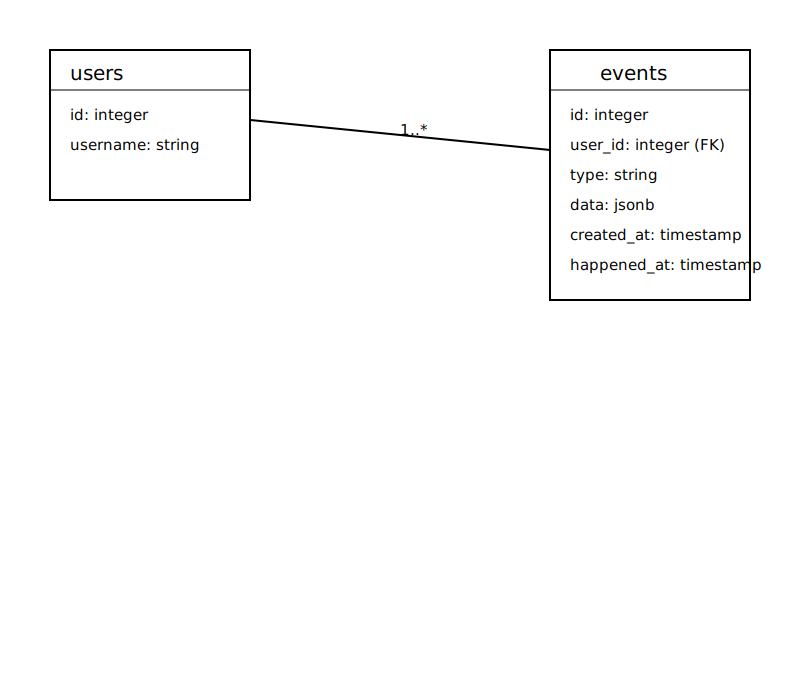

# Hasura Events

Simple events logging app:

```bash
make boot project=hasura-events
```

Or by setting `project=hasura-events` in your `Makefile.env` file:

```make
# Makefile.env

project=hasura-events
```

## Building the SQL Schema with ChatGPT

### 🙍‍♂️ Me

```Markdown
Build the schema of a multi tenant event logging system based on Postgres.
I need the following tables:

- users
- events

Here are some other requirements:

Each event belong to a user
Deleting a user should also delete all the related data
Each event should have a string based type
Each event should have a jsonb column called "data"
```

### 🤖 ChatGPT

```sql
CREATE TABLE users
(
    id SERIAL PRIMARY KEY,
    tenant_id INT NOT NULL,
    username VARCHAR(255) NOT NULL,
    password VARCHAR(255) NOT NULL,
    -- Any additional fields...
);

CREATE TABLE events
(
    id SERIAL PRIMARY KEY,
    user_id INT NOT NULL,
    type VARCHAR(255) NOT NULL,
    data JSONB NOT NULL,
    FOREIGN KEY (user_id) REFERENCES users (id) ON DELETE CASCADE
    -- ON DELETE CASCADE ensures that deleting a user deletes all related events
);
```

### 🙍‍♂️ Me

```Markdown
Remove the tenant_id column, wrap each column and table name with double quotes, also specify the schema wrapping it with double quotes. You also forgot a created_at colump for tracking the event. Add also an "happened_at" column to trak the real pot of the event.
```

### 🤖 ChatGPT

```sql
CREATE TABLE "public"."users"
(
    "id" SERIAL PRIMARY KEY,
    "username" VARCHAR(255) NOT NULL,
    "password" VARCHAR(255) NOT NULL
    -- Any additional fields...
);

CREATE TABLE "public"."events"
(
    "id" SERIAL PRIMARY KEY,
    "user_id" INT NOT NULL,
    "type" VARCHAR(255) NOT NULL,
    "data" JSONB NOT NULL,
    "created_at" TIMESTAMP WITH TIME ZONE DEFAULT CURRENT_TIMESTAMP,
    "happened_at" TIMESTAMP WITH TIME ZONE,
    FOREIGN KEY ("user_id") REFERENCES "public"."users" ("id") ON DELETE CASCADE
);
```

### 🙍‍♂️ Me

```Markdown
No need for a password for now. The "happened_at" should default to "create_at" in case is left empty.
```

### 🤖 ChatGPT

```sql
CREATE TABLE "public"."users"
(
    "id" SERIAL PRIMARY KEY,
    "username" VARCHAR(255) NOT NULL
    -- Any additional fields...
);

CREATE TABLE "public"."events"
(
    "id" SERIAL PRIMARY KEY,
    "user_id" INT NOT NULL,
    "type" VARCHAR(255) NOT NULL,
    "data" JSONB NOT NULL,
    "created_at" TIMESTAMP WITH TIME ZONE DEFAULT CURRENT_TIMESTAMP,
    "happened_at" TIMESTAMP WITH TIME ZONE DEFAULT CURRENT_TIMESTAMP,
    FOREIGN KEY ("user_id") REFERENCES "public"."users" ("id") ON DELETE CASCADE
);
```

### 🙍‍♂️ Me

I'm quite satisfied with this schema, so I try to apply it as initial migration... It works, my schema is being correctly created!

Now it's time to produce some seed into it:

```Markdown
Create 5 users giving them funny CamelCased names.
Then seed 10000 events that should represent some football games with randomic data of your choiche.
Then seed 10000 events that should represent some baseball games with randomic data of your choiche.
Then seed 10000 events that should represent some golf games with randomic data of your choiche.
Ditribute the events randomly among the existing users.
```

### 🤖 ChatGPT

It gives me this query for the users, which I like.

```sql
INSERT INTO "public"."users" ("username")
VALUES 
('HappyGoalie'),
('ScoringStriker'),
('DefensiveDribbler'),
('JollyKeeper'),
('DashingDefender');
```

But then it starts proposing me a Python script for the randomized data. So I stop the bot.

### 🙍‍♂️ Me

I prefer to keep the seeding in pure sql and I know you can use `generate_series` to generate large amounts of data, so I decide to give him some help:

```Markdown
Ok with the users, but for the rest I'd prefer to keep SQL as the only language.
You can use "generate_series" to generate large amounts of data.
Please randomize the "happened_at" with a random point in time (to the second) within the last two years.
```

### 🤖 ChatGPT

```sql
-- Football events
INSERT INTO "public"."events" ("user_id", "type", "data", "happened_at")
SELECT 
    (random() * 4 + 1)::int, -- Random user_id between 1 and 5
    'Football',
    jsonb_build_object('score', (random() * 10)::int, 'stadium', 'Stadium ' || (random() * 10 + 1)::int),
    NOW() - (random() * interval '2 years')
FROM generate_series(1,10000);

-- Baseball events
INSERT INTO "public"."events" ("user_id", "type", "data", "happened_at")
SELECT 
    (random() * 4 + 1)::int, -- Random user_id between 1 and 5
    'Baseball',
    jsonb_build_object('runs', (random() * 10)::int, 'stadium', 'Stadium ' || (random() * 10 + 1)::int),
    NOW() - (random() * interval '2 years')
FROM generate_series(1,10000);

-- Golf events
INSERT INTO "public"."events" ("user_id", "type", "data", "happened_at")
SELECT 
    (random() * 4 + 1)::int, -- Random user_id between 1 and 5
    'Golf',
    jsonb_build_object('strokes', (random() * 72)::int, 'course', 'Course ' || (random() * 10 + 1)::int),
    NOW() - (random() * interval '2 years')
FROM generate_series(1,10000);
```

### 🙍‍♂️ Me

I like what I see, and I decide to try it out in my default seed... And it works!

The problem is that if I re-seed it, it will duplicate data and ids.

I'd like my seeds to be pure!

```Markdown
Please give me the truncate instructions and also the instructions to reset the related number series. 
I want to be able to repeat the seeding and obtain the very same result each time.
```

### 🤖 ChatGPT

```sql
TRUNCATE "public"."users", "public"."events" RESTART IDENTITY CASCADE;

SELECT setval(pg_get_serial_sequence('"public"."users"', 'id'), 1, false);
SELECT setval(pg_get_serial_sequence('"public"."events"', 'id'), 1, false);
```

### 🙍‍♂️ Me

This looks promising... And it works. Fantastic. So far, zero errors!

Last step is to get the down migration:

```Markdown
Giveme the code to drop the tables in the correct order so that it doesn't break any constraint.
```

### 🤖 ChatGPT

```sql
DROP TABLE IF EXISTS "public"."events";
DROP TABLE IF EXISTS "public"."users";
```

### 🙍‍♂️ Me

Ok, this was rather simple, but it's missing the `CASCADE` parameter:

```Markdown
Are you sure this will remove any related or dependent object? Aren't you missing a small clause?
```

### 🤖 ChatGPT

And I get the correct stuff, it even apologizes to me!

```sql
DROP TABLE IF EXISTS "public"."events" CASCADE;
DROP TABLE IF EXISTS "public"."users" CASCADE;
```

### 🙍‍♂️ Me

I decided now to go bold, very bold:

```Markdown
Please generate the XML for an SVG that shows the sql schema and its relations
```

### 🤖 ChatGPT

```xml
<svg xmlns="http://www.w3.org/2000/svg" version="1.1" width="800" height="600">
    <rect x="50" y="50" width="200" height="100" stroke="black" fill="transparent" stroke-width="2"/>
    <text x="100" y="90" font-family="Verdana" font-size="20" fill="black">users</text>

    <rect x="550" y="50" width="200" height="100" stroke="black" fill="transparent" stroke-width="2"/>
    <text x="600" y="90" font-family="Verdana" font-size="20" fill="black">events</text>

    <line x1="250" y1="100" x2="550" y2="100" style="stroke:black;stroke-width:2" />
    <text x="400" y="90" font-family="Verdana" font-size="15" fill="black">user_id</text>
</svg>
```


### 🙍‍♂️ Me

This doesn't work.

```Markdown
Give me the full source that I should put into an SVG file so that I can show it in my README.
```
### 🤖 ChatGPT

```xml
<svg xmlns="http://www.w3.org/2000/svg" version="1.1" width="800" height="600">
    <!-- Users Table -->
    <rect x="50" y="50" width="200" height="150" stroke="black" fill="transparent" stroke-width="2"/>
    <text x="70" y="80" font-family="Verdana" font-size="20" fill="black">users</text>
    <line x1="50" y1="90" x2="250" y2="90" style="stroke:black;stroke-width:1" />
    <text x="70" y="120" font-family="Verdana" font-size="15" fill="black">id: integer</text>
    <text x="70" y="150" font-family="Verdana" font-size="15" fill="black">username: string</text>

    <!-- Events Table -->
    <rect x="550" y="50" width="200" height="200" stroke="black" fill="transparent" stroke-width="2"/>
    <text x="600" y="80" font-family="Verdana" font-size="20" fill="black">events</text>
    <line x1="550" y1="90" x2="750" y2="90" style="stroke:black;stroke-width:1" />
    <text x="570" y="120" font-family="Verdana" font-size="15" fill="black">id: integer</text>
    <text x="570" y="150" font-family="Verdana" font-size="15" fill="black">user_id: integer (FK)</text>
    <text x="570" y="180" font-family="Verdana" font-size="15" fill="black">type: string</text>
    <text x="570" y="210" font-family="Verdana" font-size="15" fill="black">data: jsonb</text>

    <!-- Relationship Line -->
    <line x1="250" y1="120" x2="550" y2="150" style="stroke:black;stroke-width:2" />
</svg>
```


### 🙍‍♂️ Me

Almost there!

```Markdown
Enforce a white background, and add the one-to-many information to the relation between the two tables.
Also, the events table is missing the two dates.
```

### 🤖 ChatGPT

```xml
<svg xmlns="http://www.w3.org/2000/svg" version="1.1" width="800" height="700">
    <!-- Background -->
    <rect width="100%" height="100%" fill="white" />

    <!-- Users Table -->
    <rect x="50" y="50" width="200" height="150" stroke="black" fill="transparent" stroke-width="2"/>
    <text x="70" y="80" font-family="Verdana" font-size="20" fill="black">users</text>
    <line x1="50" y1="90" x2="250" y2="90" style="stroke:black;stroke-width:1" />
    <text x="70" y="120" font-family="Verdana" font-size="15" fill="black">id: integer</text>
    <text x="70" y="150" font-family="Verdana" font-size="15" fill="black">username: string</text>

    <!-- Events Table -->
    <rect x="550" y="50" width="200" height="250" stroke="black" fill="transparent" stroke-width="2"/>
    <text x="600" y="80" font-family="Verdana" font-size="20" fill="black">events</text>
    <line x1="550" y1="90" x2="750" y2="90" style="stroke:black;stroke-width:1" />
    <text x="570" y="120" font-family="Verdana" font-size="15" fill="black">id: integer</text>
    <text x="570" y="150" font-family="Verdana" font-size="15" fill="black">user_id: integer (FK)</text>
    <text x="570" y="180" font-family="Verdana" font-size="15" fill="black">type: string</text>
    <text x="570" y="210" font-family="Verdana" font-size="15" fill="black">data: jsonb</text>
    <text x="570" y="240" font-family="Verdana" font-size="15" fill="black">created_at: timestamp</text>
    <text x="570" y="270" font-family="Verdana" font-size="15" fill="black">happened_at: timestamp</text>

    <!-- Relationship Line -->
    <line x1="250" y1="120" x2="550" y2="150" style="stroke:black;stroke-width:2" />
    <text x="400" y="135" font-family="Verdana" font-size="15" fill="black">1..*</text>
</svg>
```



### 🙍‍♂️ Me

Enough with SVGs

Now we get into the serious stuff. I want to build the Hasura metadata so to expose this schema as an API.

I am not yet sure how to proceed.

### 🤖 ChatGPT
### 🙍‍♂️ Me
### 🤖 ChatGPT
### 🙍‍♂️ Me
### 🤖 ChatGPT
### 🙍‍♂️ Me
### 🤖 ChatGPT
### 🙍‍♂️ Me
### 🤖 ChatGPT
### 🙍‍♂️ Me
### 🤖 ChatGPT
### 🙍‍♂️ Me
### 🤖 ChatGPT
### 🙍‍♂️ Me
### 🤖 ChatGPT
### 🙍‍♂️ Me
### 🤖 ChatGPT
### 🙍‍♂️ Me
### 🤖 ChatGPT
### 🙍‍♂️ Me
### 🤖 ChatGPT
### 🙍‍♂️ Me
### 🤖 ChatGPT